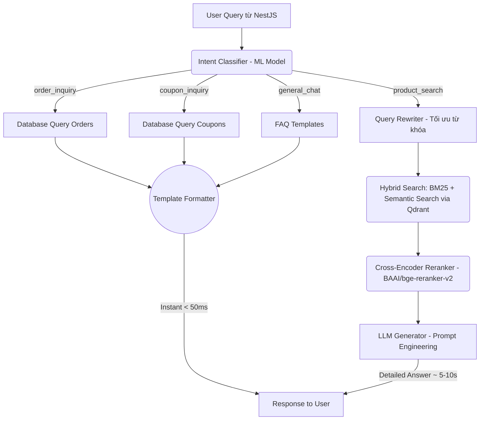

# Homura Shop - AI Chatbot Sidecar

Đây là hệ thống Chatbot Agentic RAG cho dự án Homura Shop, chạy dưới dạng một service FastAPI riêng biệt (Sidecar). Nó chịu trách nhiệm xử lý ngôn ngữ tự nhiên, phân loại ý định người dùng và tìm kiếm thông tin sản phẩm bằng công nghệ RAG tiên tiến.

## Công Nghệ & Thư Viện Sử Dụng (Tech Stack)
- **Core Framework**: FastAPI, Uvicorn, Python 3.13.
- **Intent Classification**: Scikit-Learn (SGDClassifier + TF-IDF) nhẹ, cực nhanh, thay thế LLM router.
- **Vector Database**: Qdrant (lưu trữ và tìm kiếm vector).
- **Embedding Model**: `BAAI/bge-m3` (để tạo vector nhúng) hoặc `VinAI/PhoBERT`.
- **Reranker Model**: `BAAI/bge-reranker-v2-m3` (sắp xếp lại kết quả tìm kiếm).
- **LLM Provider**: Google Gemini (Mặc định) / OpenAI (Fallback) cho text generation.
- **ORM & Database**: SQLAlchemy kết nối với PostgreSQL để lấy dữ liệu real-time.

## Kiến Trúc Pipeline

Hệ thống AI xử lý yêu cầu theo luồng sau để vừa đảm bảo độ chính xác (Accuracy) vừa tối ưu tốc độ (Latency).



## Tính năng nổi bật
- **Intent Routing**: Tự động phân loại 4 ý định chính (mua sắm, kiểm tra đơn hàng, tìm mã giảm giá, tán gẫu).
- **Agentic RAG**: Cung cấp thông tin sản phẩm chính xác dựa trên kho dữ liệu (Vector DB Qdrant) kết hợp Hybrid search (BM25 + Dense Vector).
- **Fast Response**: Trả lời ngay lập tức (<50ms) cho các tra cứu đơn hàng/mã giảm giá qua **Deterministic Template Format**, bỏ qua LLM.
- **Reranker Engine**: Cải thiện độ chính xác tìm kiếm sản phẩm bằng cách chấm điểm lại danh sách kết quả (cross-encoder Reranking).

## Cài đặt & Khởi chạy

### 1. Môi trường Conda
Nên sử dụng Miniconda/Anaconda để quản lý dependency Python:
```bash
conda create -n aiEnv python=3.13
conda activate aiEnv
```

### 2. Cài đặt thư viện
```bash
pip install -r requirements.txt
```

### 3. Cấu hình biến môi trường
AI module sử dụng file `.env` nằm ở thư mục cha (`Web-ban-hang/.env`). 
Bắt buộc có:
- `DATABASE_URL`: Kết nối vào PostgreSQL gốc.
- `GEMINI_API_KEY` (hoặc `OPENAI_API_KEY`): Cấu hình provider cho RAG.

### 4. Khởi chạy Server
Chạy Development (có tính năng hot-reload code):
*(Lưu ý: Không nên dùng khi debug frontend, vì mỗi khi bạn vô tình sửa code Python, FastAPI sẽ load lại mô hình ML nặng mất 60s, dẫn đến 503 Timeout).*
```bash
python -m fastapi dev main.py
```

Chạy Production (Ổn định, không load lại mô hình tự động):
```bash
python -m uvicorn main:app --host 0.0.0.0 --port 8000
```

## Lưu ý quan trọng
- Dữ liệu train mô hình Intent (như `data/dataset_translate.csv`) khá nặng nên đã được đưa vào `.gitignore`.
- Model Weights ban đầu có thể chưa được tải, FastAPI sẽ tự động download các model HuggingFace (`bge-m3`, `bge-reranker-v2-m3`) ở lần chạy đầu tiên. Hãy kiên nhẫn.
- Cấu hình Timeout bên NestJS Proxy hiện tại là **120s** để bao gồm cả thời gian khởi động model của AI sidecar.
